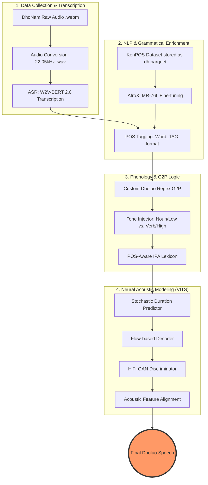

# Dholuo POS-Aware TTS Pipeline 🇰🇪


This repository contains a complete pipeline for building a high-fidelity, natural-sounding Text-to-Speech (TTS) system for the **Dholuo** language. Unlike standard multilingual TTS, this system uses a **Part-of-Speech (POS) aware G2P (Grapheme-to-Phoneme)** approach to solve the problem of homograph disambiguation and tonal accuracy.

---

## 🌟 Features

- **Grammatical Disambiguation**
  Uses a fine-tuned **AfroXLMR** model to identify POS tags, allowing the system to distinguish between homographs (e.g., _dhok_ as "mouth" vs. "cows").

- **Tonal Injection**
  Automatically injects tone markers (`˥` for high, `˩` for low) into the phonetic transcription based on grammatical categories (Nouns vs. Verbs).

- **Custom Dholuo G2P**
  A specialized phonemizer that handles Dholuo-specific digraphs (`ny`, `ng'`, `th`, `dh`) and ATR vowel harmony.

- **Gender-Specific Voice Models**
  Separate training pipelines for male and female voices, with automatic dataset splitting by speaker gender.

- **Modular Architecture**
  Separated concerns with dedicated modules: `phonemizer.py` for G2P, `tagger.py` for POS tagging, and `utils.py` for shared utilities.

- **Comprehensive Testing**
  Full test suite covering unit tests, integration tests, and end-to-end pipeline validation with gender-specific model testing.

- **End-to-End VITS**
  Training on the state-of-the-art **VITS** (Variational Inference with adversarial learning for end-to-end Text-to-Speech) architecture.

- **Interactive Demo**
  Beautiful Gradio-based interface for live testing with waveform and spectrogram visualizations.

- **Production-Ready API**
  FastAPI backend with Redis caching and Nginx reverse proxy.

- **Dockerized Deployment**
  Simple deployment using Docker and Docker Compose.

- **Hugging Face Integration**
  Automatic model downloading from the [Hugging Face Hub](https://huggingface.co/sowallah/dholuo-tts-models).

---

## 🏗️ Architecture



### NLP Phase

- Fine-tune `Davlan/afro-xlmr-large-76L` on the **KenPOS Dholuo** dataset.

### Preprocessing Phase

- Transcribe **DhoNam** audio using **W2V-BERT 2.0**.
- Filter for high-confidence recordings (>80%).
- Tag transcripts with the POS model (`Word_TAG` format).

### G2P Phase

- Convert `Word_TAG` units into **IPA phonemes** with associated pitch markers.

### Acoustic Phase

- Train **VITS** on RunPod (NVIDIA RTX A5000) to map **IPA + Tones** to raw audio.

---

## 📁 Project Structure

```
dholuo_tts/
├── api/                   # FastAPI backend services
│   ├── main.py            # API entry point
│   ├── routes.py          # API endpoints
│   └── cache.py           # Redis caching logic
├── demo/                  # Gradio web interface
│   ├── app.py             # Demo entry point
│   ├── components.py      # UI components
│   └── visualizations.py  # Waveform/Spectrogram plots
├── docker/                # Deployment configurations
│   ├── Dockerfile         # API Dockerfile
│   ├── Dockerfile.demo    # Demo Dockerfile
│   └── docker-compose.yml # Full stack orchestration
├── scripts/               # Utility and launch scripts
│   ├── launch_demo.sh     # Quick start script (Local/Docker)
│   ├── verify_demo.py     # End-to-end pipeline verification
│   └── upload_models_to_hub.py # HF Hub synchronization
├── phonemizer.py          # G2P converter with tone injection
├── tagger.py              # POS tagging with AfroXLMR
├── utils.py               # Shared utilities and custom VITS model
├── generate_lexicon.py    # Bulk IPA lexicon generator
├── transcribe_audio.py    # Audio transcription & gender splitting
├── preprocess_dhonam.py   # POS tagging pipeline
├── create_vits_metadata.py # IPA conversion & metadata generation
├── train_vits.py          # VITS training script
├── tests/                 # Comprehensive test suite
│   ├── test_phonemizer.py
│   ├── test_integration.py
│   ├── test_phonemizer_with_tagger.py
│   ├── test_model.py      # End-to-end TTS inference test
│   └── output/            # Generated test audio files
├── data/
│   ├── dholuo_lexicon.json  # POS-aware IPA dictionary
│   ├── audio/
│   │   ├── wav/           # All audio files
│   │   ├── wav_male/      # Male speaker audio
│   │   └── wav_female/    # Female speaker audio
│   └── csv/
│       ├── users-meta.csv              # Speaker gender metadata
│       ├── final_dataset.csv           # Combined transcribed dataset
│       ├── male_dataset.csv            # Male transcriptions
│       ├── female_dataset.csv          # Female transcriptions
│       ├── tts-metadata.csv            # POS-tagged metadata
│       ├── train_metadata.csv          # Combined training metadata
│       ├── male_training_metadata.csv  # Male-specific metadata
│       └── female_training_metadata.csv # Female-specific metadata
└── models/
    ├── luo-pos/             # Fine-tuned POS tagger
    └── luo-tts/
        ├── male/            # Male voice checkpoints
        └── female/          # Female voice checkpoints
```

---

## 🚀 Getting Started

### 🔧 Installation & Setup

#### 1. System Dependencies

The TTS engine requires **espeak-ng** for phoneme processing:

```bash
sudo apt-get update && sudo apt-get install espeak-ng -y
```

#### 2. Python Environment

Install required Python packages using `uv`:

```bash
uv sync
```

Or with pip:

```bash
pip install TTS pandas transformers accelerate torchaudio tqdm
```

---

## 🛠️ Pipeline Execution

### Phase 1: POS Tagger Fine-Tuning

Fine-tune the `Davlan/afro-xlmr-large-76L` model using the **KenPOS** dataset (`dh.parquet`).

```bash
uv run train_pos_local.py   # For local training
uv run train_pos_cloud.py   # For cloud training
```

### Phase 2: Audio Transcription & Gender Splitting

Transcribe the DhoNam audio files and automatically split by gender.

```bash
uv run transcribe_audio.py
```

This creates:

- `final_dataset.csv` - Combined transcriptions with metadata
- `male_dataset.csv` / `female_dataset.csv` - Gender-specific transcriptions
- `wav_male/` / `wav_female/` - Gender-specific audio folders

### Phase 3: POS Tagging

Apply POS tags to transcriptions.

```bash
uv run preprocess_dhonam.py
```

Creates `tts-metadata.csv` with format: `audio_file|transcript|pos_tagged`

### Phase 3: Lexicon Generation

Generate the IPA phonetic dictionary with POS-aware tone markers.

```bash
uv run generate_lexicon.py
```

This creates `data/dholuo_lexicon.json` with entries like:

```json
{
  "nam_NN": "nam˩",
  "ringo_V": "ɾiŋgɔ˥",
  "dho_NN": "ðɔ˩"
}
```

### Phase 4: VITS Metadata Creation

Convert POS-tagged metadata to IPA phonemes and split by gender.

```bash
uv run create_vits_metadata.py
```

This creates:

- `train_metadata.csv` - Combined IPA phoneme metadata
- `male_training_metadata.csv` - Male-specific training data
- `female_training_metadata.csv` - Female-specific training data

### Phase 5: VITS Training

Train gender-specific acoustic models on an NVIDIA GPU.

```bash
# Train female voice model
python train_vits.py --gender female

# Train male voice model
python train_vits.py --gender male
```

---

## 🧪 Testing

Run the comprehensive test suite:

```bash
# Test phonemizer G2P and tone injection
uv run python tests/test_phonemizer.py

# Test integration with tagged pairs
uv run python tests/test_integration.py

# Test end-to-end with mock tagger
uv run python tests/test_phonemizer_with_tagger.py

# Test full TTS model inference with interactive prompts
uv run python tests/test_model.py
```

The test_model.py script supports:

- Interactive text input (or uses default Dholuo sentence)
- Gender selection (male/female) at runtime
- Configurable checkpoint by modifying the CHECKPOINT_NAME variable

---

## 🎤 Running the Demo

The easiest way to experience the Dholuo TTS system is through the interactive Gradio demo.

### Local Launch

```bash
./scripts/launch_demo.sh local
```

The demo will be available at `http://localhost:7860`. Models will be automatically downloaded from Hugging Face if not found locally.

### Docker Launch

```bash
./scripts/launch_demo.sh docker
```

---

## 🌐 API Deployment

For production use, you can deploy the full stack (API + Redis + Nginx) using Docker Compose.

```bash
docker-compose -f docker/docker-compose.yml up --build
```

- **API Documentation**: `http://localhost:8000/docs`
- **Nginx Proxy**: `http://localhost:80`

---

## 🔧 Module Usage

### Phonemizer

```python
from phonemizer import Phonemizer

# Initialize without tagger for direct phonemization
p = Phonemizer(tagger=False)

# Convert word with POS tag to IPA
ipa = p.phonemize("dho", "NN")  # Returns: "ðɔ˩"

# Process tagged pairs
tagged = [("nyithindo", "NN"), ("ringo", "V")]
result = p.phonemize_tagged_pairs(tagged)  # Returns: "ɲiθindɔ˩ ɾiŋgɔ˥"
```

### Tagger

```python
from tagger import Tagger

# Initialize POS tagger
tagger = Tagger()

# Tag raw text
tagged_pairs = tagger.tag("Nyithindo ringo e dala")
# Returns: [("nyithindo", "NN"), ("ringo", "V"), ("e", "P"), ("dala", "NN")]
```

### End-to-End Pipeline

```python
from phonemizer import Phonemizer
from tagger import Tagger

# Initialize components
tagger = Tagger()
phoneme = Phonemizer(tagger=tagger)

# Process raw text to IPA
text = "Nyithindo ringo e dala"
ipa_output = phoneme.phonemize_text(text)
print(ipa_output)  # "ɲiθindɔ˩ ɾiŋgɔ˥ ɛ dala˩"
```

---

## 📂 Dataset Credits

- **[KenPOS](https://huggingface.co/datasets/Kencorpus/KenPOS)**: Dholuo Part-of-Speech dataset (locally stored as `dh.parquet`).
- **[DhoNam](https://datacollective.mozillafoundation.org/datasets/cmjepxo6t08nmmk07iauvua6v)**: Dholuo Speech dataset used for ASR and TTS training.
- **[AfroXLMR](https://huggingface.co/Davlan/afro-xlmr-large)**: Pre-trained multilingual model by Davlan, used as the backbone for Nilotic NLP tasks.

---

## ⚖️ License

This project is licensed under the **MIT License** — see the `LICENSE` file for details.

---
