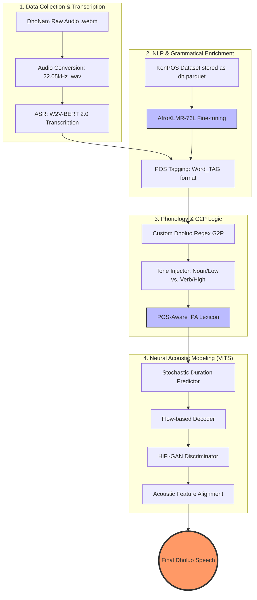

# Dholuo POS-Aware TTS Pipeline 🇰🇪


This repository contains a complete pipeline for building a high-fidelity, natural-sounding Text-to-Speech (TTS) system for the **Dholuo** language. Unlike standard multilingual TTS, this system uses a **Part-of-Speech (POS) aware G2P (Grapheme-to-Phoneme)** approach to solve the problem of homograph disambiguation and tonal accuracy.

---

## 🌟 Features

- **Grammatical Disambiguation**
  Uses a fine-tuned **AfroXLMR** model to identify POS tags, allowing the system to distinguish between homographs (e.g., _dhok_ as "mouth" vs. "cows").

- **Tonal Injection**
  Automatically injects tone markers (`˥` for high, `˩` for low) into the phonetic transcription based on grammatical categories (Nouns vs. Verbs).

- **Custom Dholuo G2P**
  A specialized phonemizer that handles Dholuo-specific digraphs (`ny`, `ng'`, `th`, `dh`) and ATR vowel harmony.

- **End-to-End VITS**
  Training on the state-of-the-art **VITS** (Variational Inference with adversarial learning for end-to-end Text-to-Speech) architecture.

---

## 🏗️ Architecture



### NLP Phase

- Fine-tune `Davlan/afro-xlmr-large-76L` on the **KenPOS Dholuo** dataset.

### Preprocessing Phase

- Transcribe **DhoNam** audio using **W2V-BERT 2.0**.
- Filter for high-confidence recordings (>80%).
- Tag transcripts with the POS model (`Word_TAG` format).

### G2P Phase

- Convert `Word_TAG` units into **IPA phonemes** with associated pitch markers.

### Acoustic Phase

- Train **VITS** on RunPod (NVIDIA RTX A5000) to map **IPA + Tones** to raw audio.

---

## 🚀 Getting Started

### 🔧 Installation & Setup

#### 1. System Dependencies

The TTS engine requires **espeak-ng** for phoneme processing:

```bash
sudo apt-get update && sudo apt-get install espeak-ng -y
```

#### 2. Python Environment

Install required Python packages:

```bash
pip install TTS pandas transformers accelerate torchaudio tqdm
```

---

## 🛠️ Pipeline Execution

### Phase 1: POS Tagger Fine-Tuning

Fine-tune the `Davlan/afro-xlmr-large-76L` model using the **KenPOS** dataset (`dh.parquet`).

```bash
python train_pos_tagger.py
```

### Phase 2: Metadata Preprocessing

Transcribe the DhoNam audio files and apply POS tags to create the training metadata.

```bash
python transcribe_audio.py
python pos_tagging.py
```

### Phase 3: Lexicon Generation

Generate the IPA phonetic dictionary with POS-aware tone markers.

```bash
python generate_lexicon.py
```

### Phase 4: VITS Training

Train the acoustic model on an NVIDIA GPU.

```bash
python train_vits.py
```

---

## 📂 Dataset Credits

- **KenPOS**: Dholuo Part-of-Speech dataset (locally stored as `dh.parquet`).
- **DhoNam**: Dholuo Speech dataset used for ASR and TTS training.
- **AfroXLMR**: Pre-trained multilingual model by Davlan, used as the backbone for Nilotic NLP tasks.

---

## ⚖️ License

This project is licensed under the **MIT License** — see the `LICENSE` file for details.

---

**Author:** Sidney Owallah
**Collaborators:** Trained on RunPod RTX A5000
**Language:** Dholuo (Luo)
